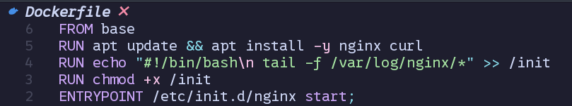
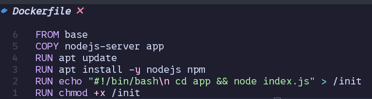
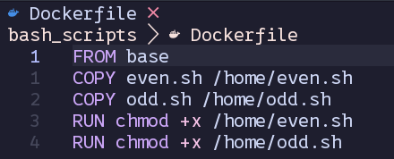
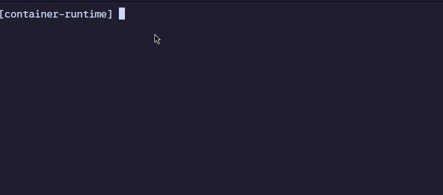
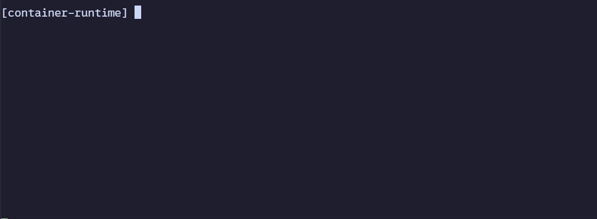
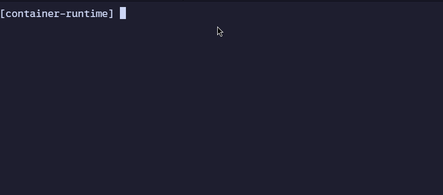

# Rust Container Runtime

[](https://opensource.org/licenses/MIT)

A lightweight container runtime implemented in Rust.

## Table of Contents

- [Introduction](#introduction)
- [What are Linux Containers?](#what-are-linux-containers)
- [How are Linux Containers Utilized?](#how-are-linux-containers-implemented)
- [Architecture](#architecture)
- [Installation](#installation)
- [Dependencies](#dependencies)
- [Usage](#usage)
- [Debugging](#debugging)
- [License](#license)

## Introduction

This is a simple implementation of the linux container runtime from scratch in Rust.

## What are Linux Containers?

Linux containers, often referred to as LXC or Docker containers, are a lightweight and portable solution for packaging, distributing, and running applications. They provide a consistent environment for applications to run across different computing environments.

### How are Linux Containers Implemented?

The main feature that allows creating containers are namespaces - which at the kernel level allow to separate the process from the outside environment.
There are different kind of namespaces such as:

- PID - maps the id's of the processes from the host enviroment to the container environment
- Network - isolates network stack in the container
- Mount - isolates mount points from the host system
- UTS - isolates hostname
- UID - isolates user from the host
- Cgroup - isolates the cgroups from the host

At the moment of writing the containers are isolated with the PID, Mount, Network, UTS and UID namespaces.

When container is started by itself it starts in an empty directory without any processes and usefull binaries.
To make containers more usable the concept of images is intruduced

### Images

Container image is nothing more than a schema of what to do to prepare the container before its start.
This usually includes copying files from the host system and installing third-party binaries.

This implementation follows simple Dockerfile schema to create images.
At the moment of writing those are available instructions:

- **COPY**: Copies directory or file from the host to the image. **The paths are relative to the path of the Dockerfile.**
- **RUN** Runs a command inside the image. This is accomplished via creating a special container on the image builded with the previous instructions. Therefor changes applied after this command will not be made to the host system, but will be accessible to all containers that start with this image.
- **ENTRYPOINT** Command provided after this directive will be run **ALWAYS** before the start of the container using that image. This is usually used to populate the database or start backgroud services.
- **FROM** - Image might use changes intruduced in another image via **FROM** directive.
  After this directive specify the name of the image you would like to base new image of. After the installation you will have tha _base_ image available out of the box.
  The _base_ image is a Debian filesystem, so all the binaries included in the Debian will be available inside this conatiner.

- Lines preceeded with '#' will be treated as comments and ignored by parser.

  Altoght the list of supported Dockefile-like commands is rather short, it is suprisingly effective.

##### How is `base` image build?

The base image is just a debian filesystem with working symlinks, device files, ect.
There are multiple ways to acquire such filesystem such as fetching the reporitory.
In this project I used debootstrap, which does exacly that.
The benefit of using debootstrap over standard fetching is compression and caching.
This base image is built only once during the installation, and new images that are based on `base` image will simply copy the image locally and build over it.
So there will be no need to run debootstrap after the installation.

### How the container is run?

Running the container is done via:

#### Mounting the image

Mounting the image that the container is using via **OverlayFS** mount, so that the image itself is not writable,
and all of the changes made by the container will disappear after container exits.
**OverlayFS** is extremly usefull here because it allows as to have the unchanged base filesystem each
time the container is stared without copying any files from the image each time the container is started.

#### Using the unshare syscall

The most important syscall in regard to creating namespaces is `unshare` which changes the namespaces of the child process.

#### Forking the process

To get the namespaces provided in earlier `unshare` call the process must be forked.

#### Setting up the rootfs

In this step the child process `chroots` into the container directory which has image mounted as non-writable layer of OverlayFS.
After the `chroot` the container-specific /proc is mounted. So that the processes are separated completly.

#### Executing all entrypoints from used image

Image metadata containains commands which need to be executed on each container start - those are entrypoints.
So before the target process is started, those commands are executed inside the container.

#### Executing the target command

Each container is created as a environment around the process that the user specifies at the start of the container.
When the process exits, the container is exited and cleaned.

### Container hooks

It is possible to use the hooks that are run at the moment the container is started, and when the container exits.
This is used to pass the container
target process PID to the client and allow the client to run
strace on the started container.

## Architecture

### Multiple clients one daemon

The project is comprised of two binaries: **client** and **daemon**.
The daemon is installed as a systemd service
which runs on the background and can communicate with multiple clients at the same time.

### Inter-Process Communication

Communication between clients and the daemon is currently implemented via UNIX sockets.

For the Unix socket implementation, the main socket for daemon is created, on which it listens for incoming commands.
When the clients connects to the daemon socket, it also opens a ephemeral client socket which is used
to send response from daemon to each client separatly.

The sockets are implemented in such a manner that
it will be exetremly easy to add TCP/IP sockets and use them, insteam of UNIX sockets.

### Multithreading

The **Container Runner** is which is responsibe for orchestrating and
managing containers is built with the multithreading in mind.
It uses a thread pool which starts the container in the thread pool
and monitors currently running conatiners.

## Installation

### What am I doing during installation?

- Create directories for images and containers in location provided in `INSTALL_PATH` in the .env file.
  If no path is specified the images and container will be installed in /var/lib/container-runtime

- Compile the binaries with `cargo build`

- Install the compiled binaries

  - container-runtime (client) to /usr/local/bin/container-runtime -> /opt/container-runtime/client
  - container-runtimed (daemon) to /usr/local/bin/container-runtimed -> /opt/container-runtime/daemon

- Download system dependcies such as **debootstrap** and **strace** with the system's package manager.
- Create systemd service unit file and move it to system directory

### How to install

#### On Debian based systems

```bash
make install_debian
```

#### On Arch based systems

```bash
make install_arch
```

#### Enable the daemon

```bash
systemctl enable container-runtimed
```

#### Check if client and daemon works

This command should list built images. The `base` image should be available out of the box.

```bash
container-runtime image list
```

## Dependencies

Container-runtime requires only two dependecies which should be installed during installation:

- **cargo** - to compile the source code [Cargo Install](https://doc.rust-lang.org/book/ch01-01-installation.html)
- **strace** - to capture the write syscalls of running containers and parse them the get the stdout of each container.
- **debootstrap** - to download base debian filesystem

Thats it!

## Usage

### Build your image or use `base`

While you can run a container without image (aka from scratch) when you have simple binary for example.
In most scenarios you would need a basic environement to run your apps or services.
To create the environement, create the Dockerfile-like file with instructions for your use case.

This project provides examples of how to create one:

#### Image with NGINX



#### Image with Node.js runtime



#### Image with simple bash scripts



#### Execute the build command:

```bash
container-runtime build {my-image-name} {path-to-the-dockerfile}
```


#### List built images

List the images that are already built and ready to use.

```bash
container-runtime image list
```



### Start the container

To start the container you have to provide the name you would like to attach to
new container, image used run the container on, network setup and the main process to run the container in.

```bash
container-runtime start {my-container-name} {image-name} {network [host,none]} {command} {args}
```


At the moment of writing the documentation, there are two networking modes available:

- `host` - uses the network stack of the host
- `none` - network inside the container is complety separated from the host

### List running containers

```bash
container-runtime list
```



### Stop the conatiner

Stop specified container (if running)

```bash
container-runtime stop {container-name}
```

## Debugging

Container runtime has logging implemented via `log4rs`.
To check what happend on the daemon, use the output passed to systemd:

```bash
systemctl status container-runtimed
```

Logs for the client will be available out-of-the-box when running client commands.
